# 51单片机的安装与破解

## 51单片机的安装

### 双击C51编译器.exe文件

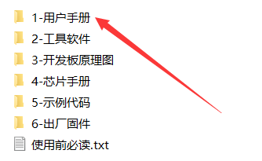

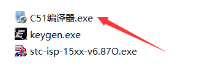

### 安装向导

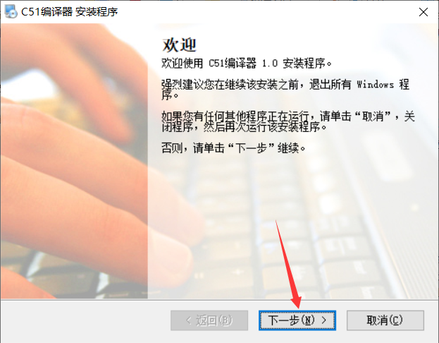

### 更改编译器的安装路径

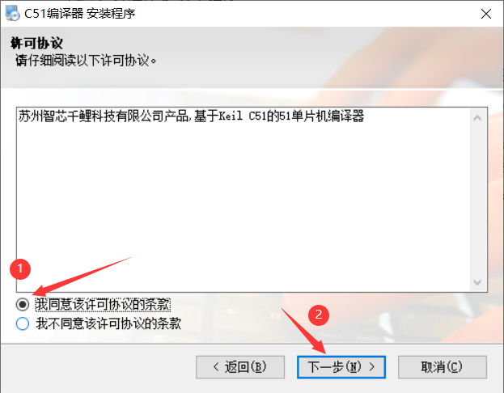

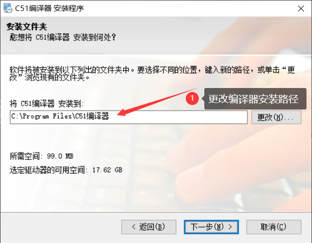

### 修改快捷方式文件夹

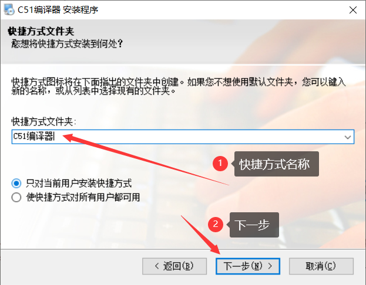

### 安装Keil C51

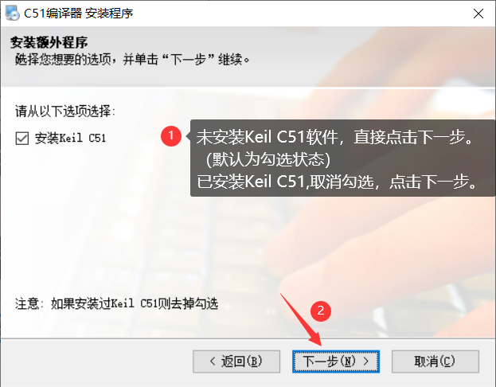

### Keil C51的安装

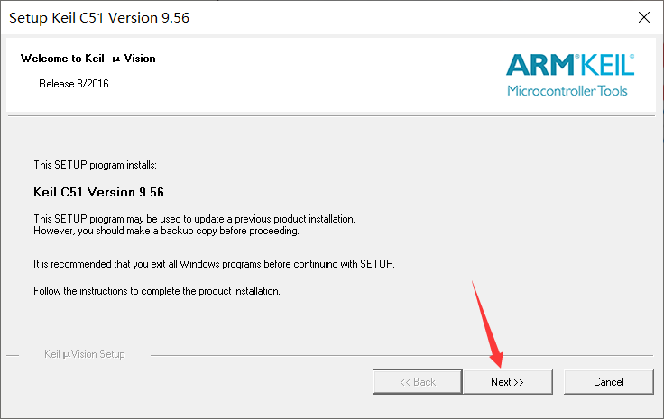

### 点击Next

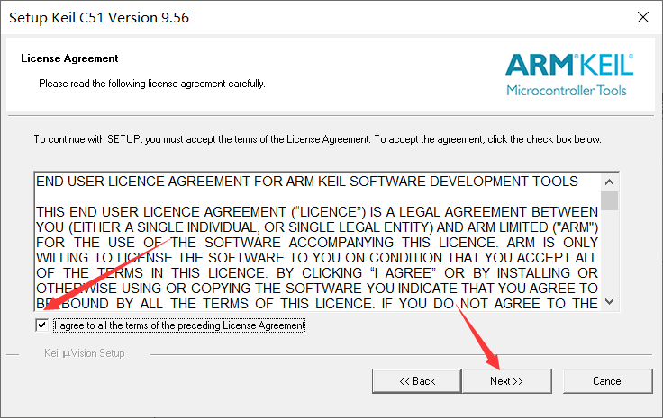

### 更改Keil C51安装路径

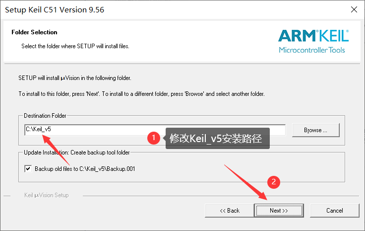

### 填写个人信息

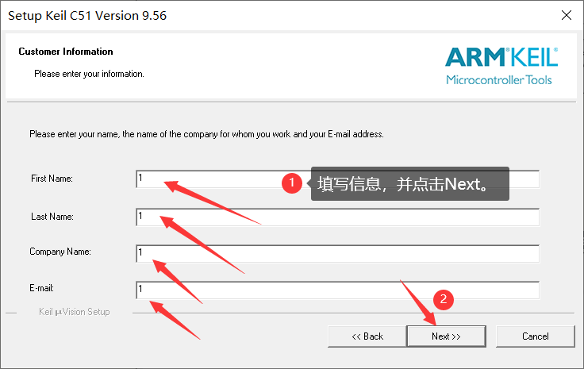

### 完成Keil C51安装

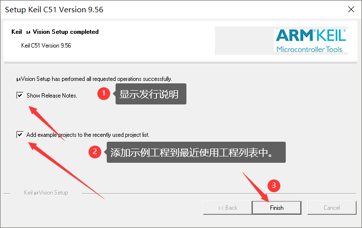

### C51编译器安装

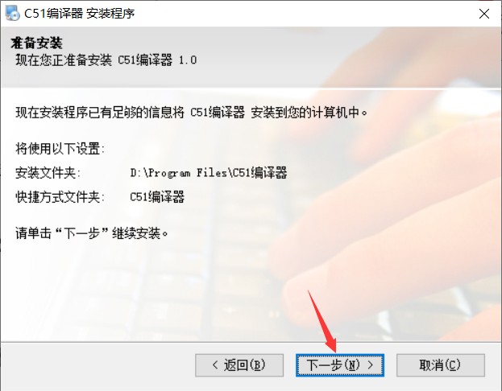

### 安装完成

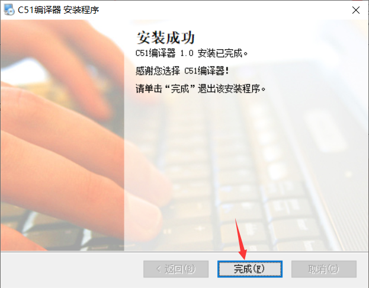

## 51单片机的破解

### **管理员身份**运行Keil uVisioon5

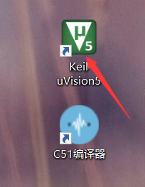

### 点击File

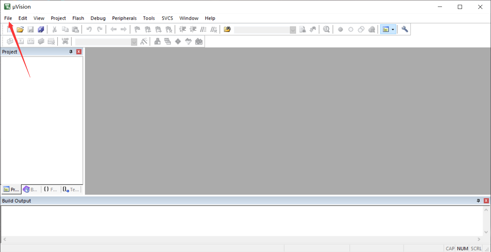

### 点击License Management...

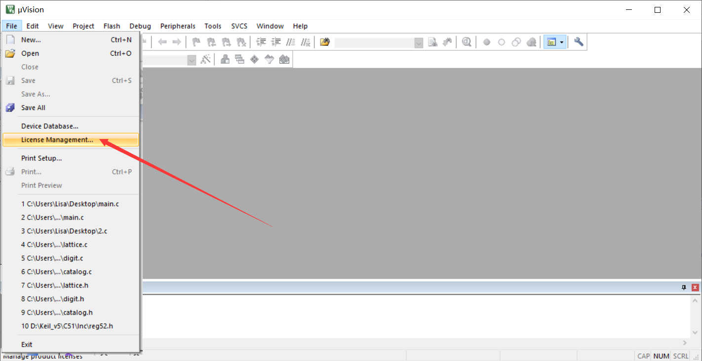

### 复制CID

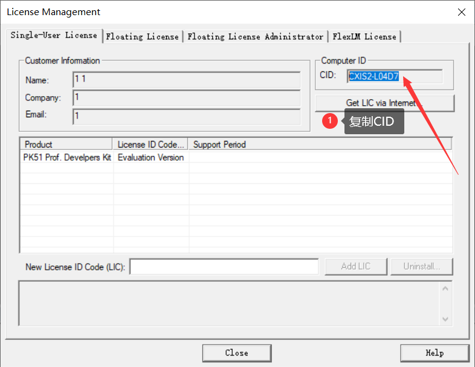

### 双击打开keygen.exe

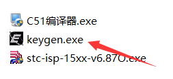

### 破解关键步骤

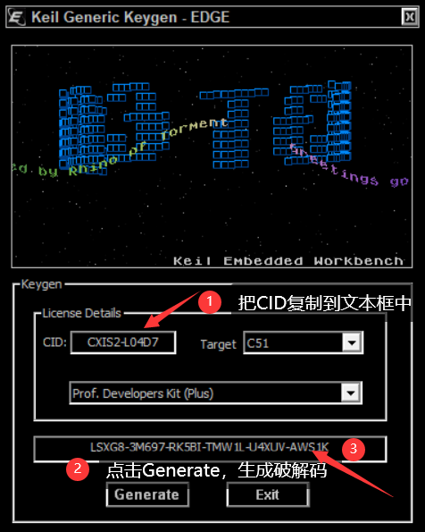

### 复制破解码

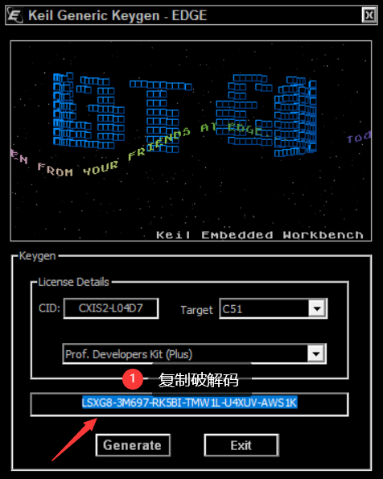

### 成功破解

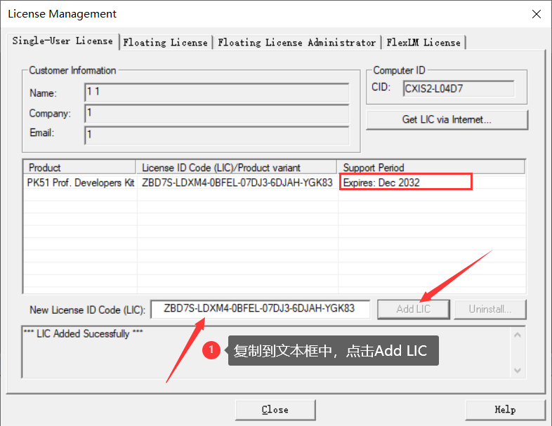

### 打开C51编译器

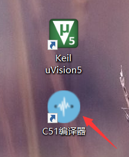

### C51编译器示意图

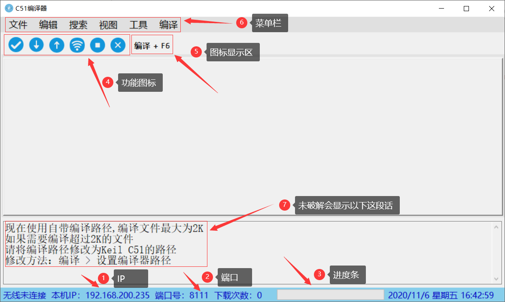

### 破解最后一步

修改方法：编译 > 设置编译器路径

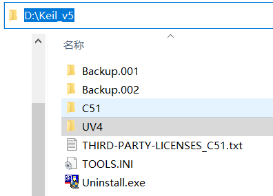

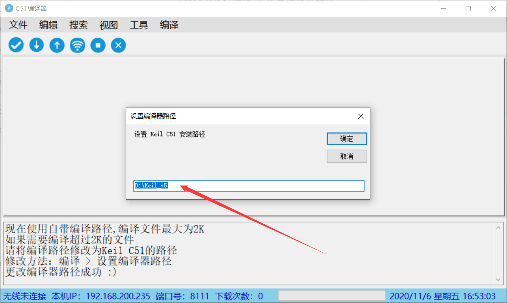

### 重新打开C51编译器

空白则破解成功！

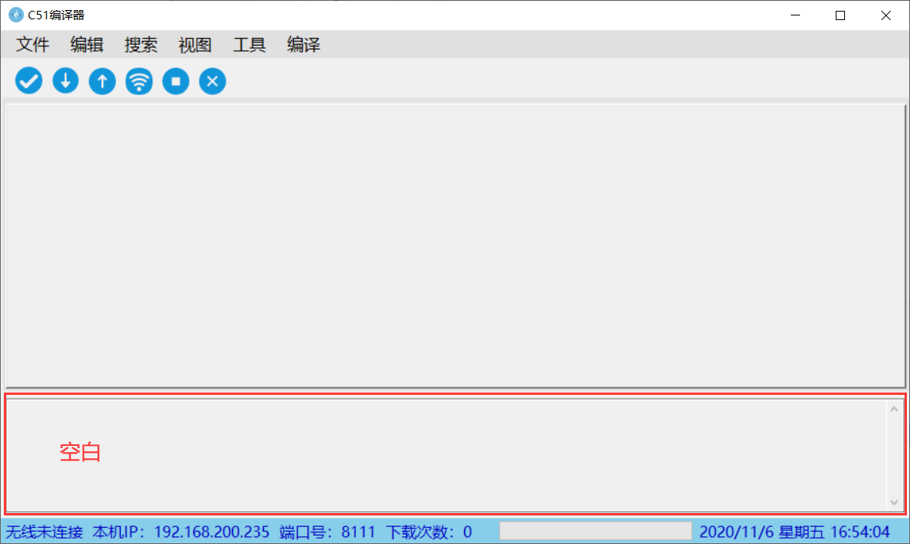

### 编译下载步骤

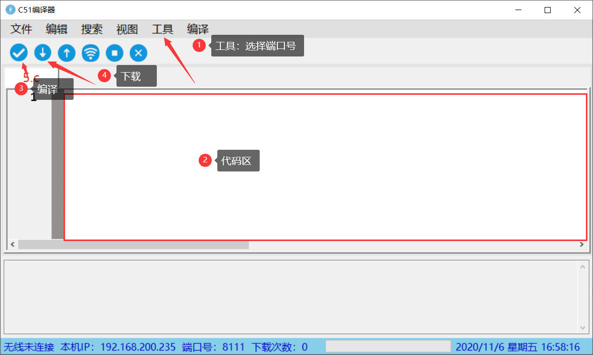

### Ps:下载失败请重新烧写固件！ 

[链接](File:///固件烧写.md)

